# DziennikRolnika

Aplikacja wspomagająca zarządzanie gospodarstwem rolnym. Pozwala na prowadzenie rejestru pól, krów, zadań oraz kalendarza rocznego.

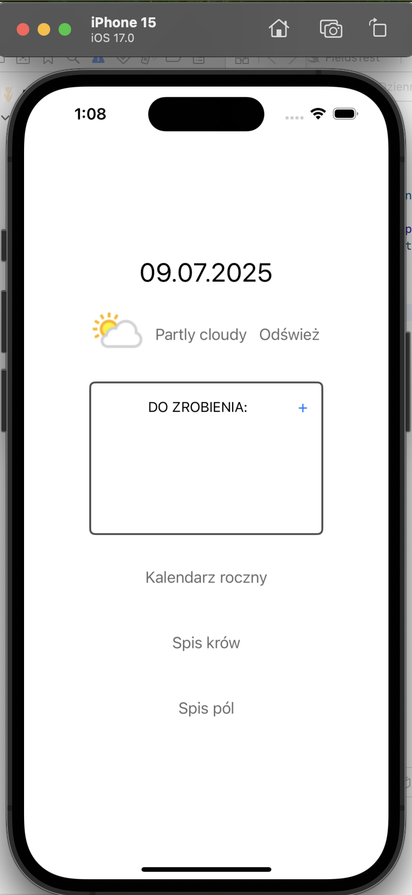

## Funkcje aplikacji

### 1. Kalendarz roczny
- Wyświetla miesiące i dni w roku.
- Oznacza specjalne dni związane z pracami rolniczymi.
- Zawiera legendę opisującą znaczenie kolorów.
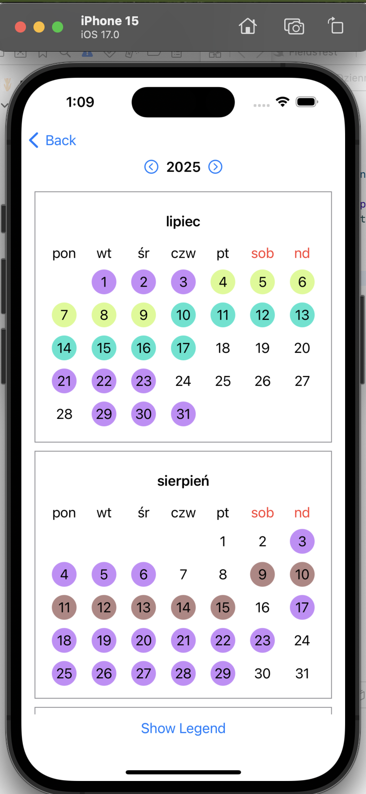
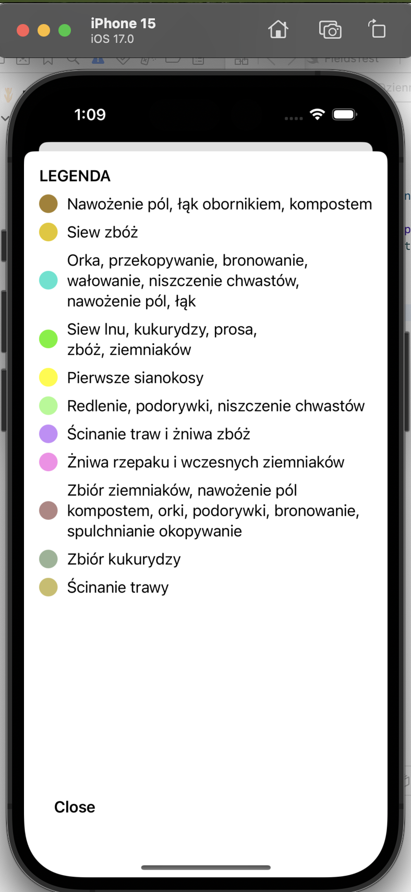

### 2. Spis pól
- Pozwala na dodawanie pól z kategoriami, historią i rysowaniem granic na mapie.
- Filtruje pola według kategorii.
- Zapisuje dane w `UserDefaults`.
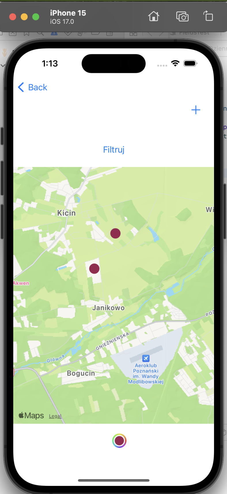
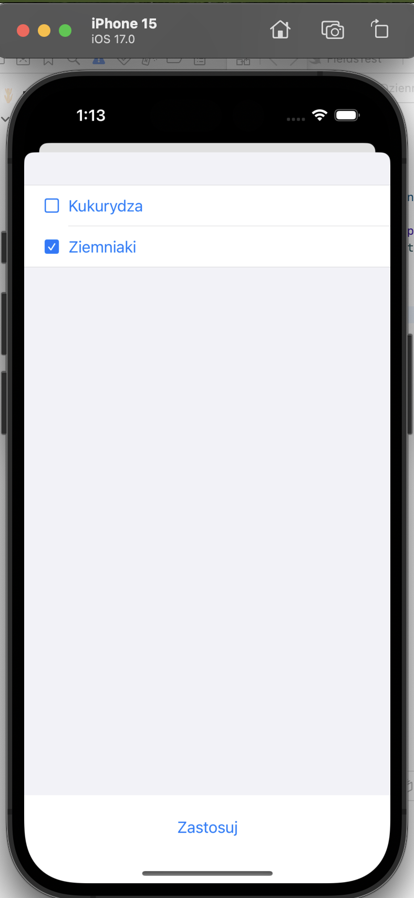
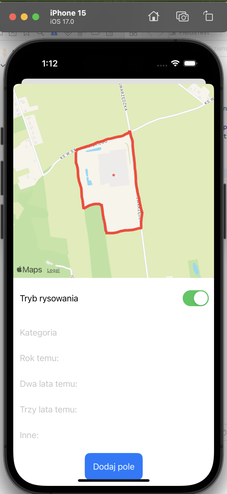
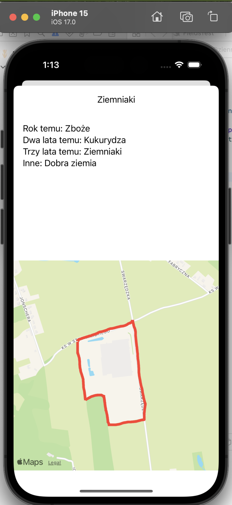

### 3. Spis krów
- Umożliwia dodawanie krów z numerem identyfikacyjnym, datą urodzenia, rasą, laktacją oraz wydarzeniami.
- Obsługuje dodawanie i usuwanie wydarzeń związanych z krowami.
- Zapisuje dane w `UserDefaults`.
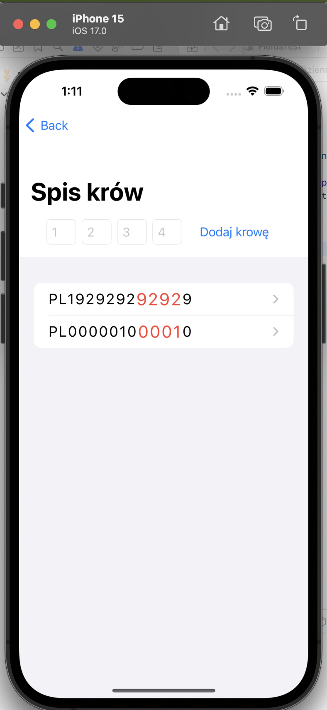
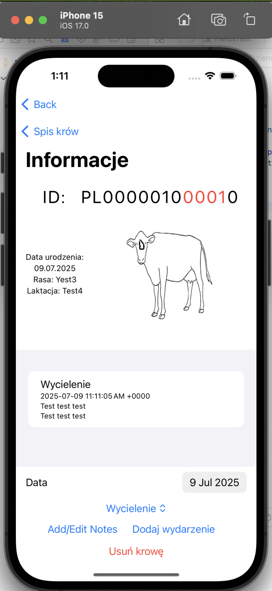
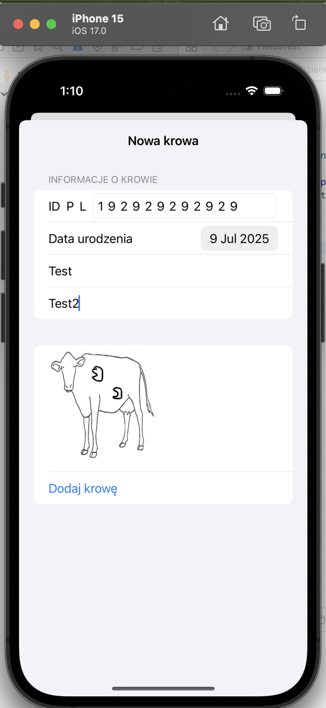

### 4. Lista zadań
- Pozwala na dodawanie, usuwanie i zarządzanie zadaniami.
- Zapisuje dane w `UserDefaults`.
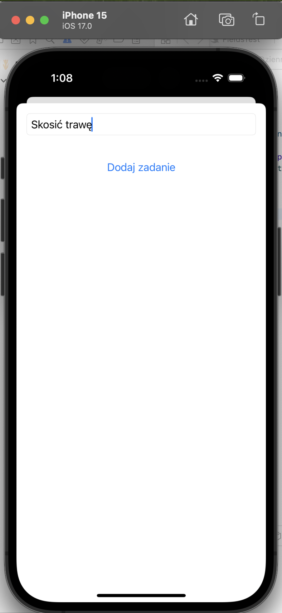
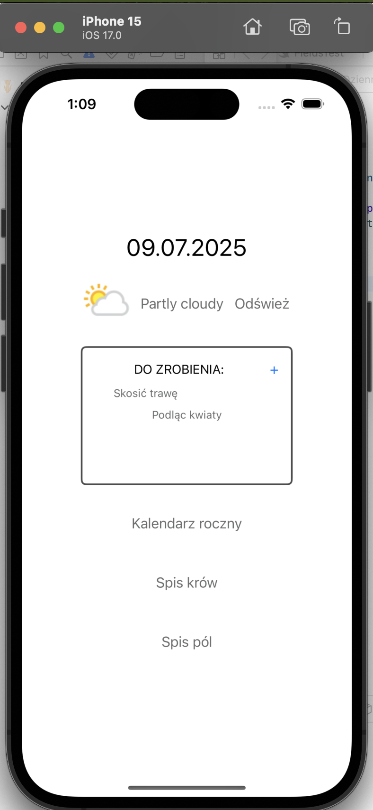

### 5. Pogoda
- Pobiera aktualne dane pogodowe dla Poznania z API WeatherAPI.

## Struktura projektu

### Pliki Swift:
- **YearCalender.swift**: Obsługuje kalendarz roczny.
- **Fields.swift**: Zarządza spisem pól.
- **Cows.swift**: Obsługuje spis krów i ich wydarzenia.
- **ContentView.swift**: Główna widok aplikacji, integruje wszystkie funkcje.
- **WeatherService.swift**: Obsługuje pobieranie danych pogodowych.
- **SpecialDays.swift**: Definiuje specjalne dni w kalendarzu.

### Technologie:
- SwiftUI
- MapKit
- UserDefaults
- WeatherAPI
